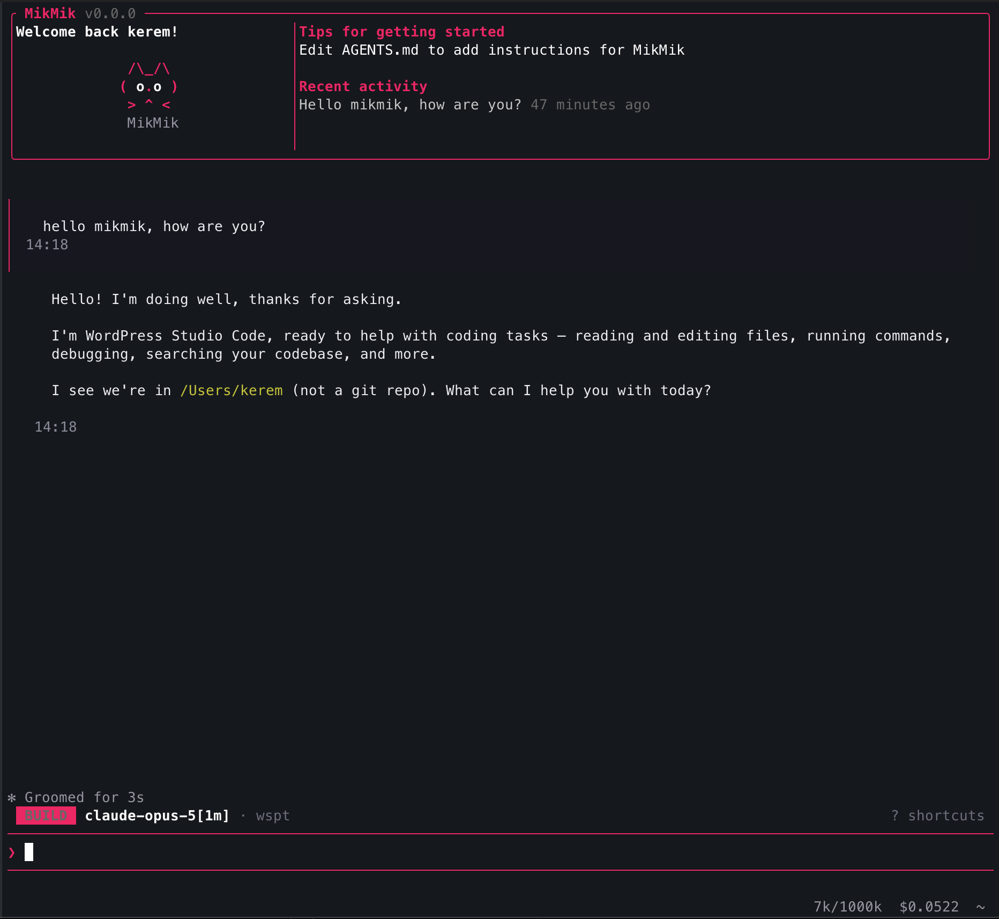

<div align="center">

<h1>MikMik</h1>
<h2><em>Agentic Coding for Builders who Ship</em></h2>


<p>
    <a href="https://github.com/KilimcininKorOglu/mikmik"></a>
    <a href="https://github.com/KilimcininKorOglu/mikmik"></a>
    <a href="https://github.com/KilimcininKorOglu/mikmik/blob/main/LICENSE.md"></a>
</p>

<br />


</div>

---

MikMik is an open-source, multi-provider terminal coding agent written from the ground up in Rust. It began as a clean-room reimplementation of Claude Code's behavior, specified in [`spec/`](https://github.com/KilimcininKorOglu/mikmik/tree/main/spec), and has grown into a full TUI pair programmer: multi-provider routing, a rich terminal UI, a plugin system, subagents and teams, session forking, memory consolidation, and editor integration over the Agent Client Protocol.

It is fast and memory-efficient, it runs however you want it to, and it collects no tracking or telemetry.

> [!IMPORTANT]
> MikMik is now officially in Beta (v1.0.0). The core agent, multi-provider routing, and TUI are stable enough for daily driving. Expect rough edges around the experimental features flagged below. Bug reports and pull requests are welcome.

---

## Table of contents

- [Features](#features)
- [Getting started](#getting-started)
- [Editor integration](#editor-integration-agent-client-protocol)
- [Supported providers](#supported-providers)
- [Documentation](#documentation)
- [Contributing](#contributing)
- [Important notice](#important-notice)

---

## Features

### Core agent

- **Multi-provider routing.** One agent, many backends. Native wire-format support for Anthropic, OpenAI, Google Gemini, Azure OpenAI, AWS Bedrock, GitHub Copilot, Codex and Cohere, plus around forty OpenAI-compatible endpoints and local runtimes. Route different work to different models in the same session.
- **Rich terminal UI.** A ratatui-based TUI with streaming output, tool-call progress, per-file diffs, dialogs, pickers and overlays.
- **Advisor.** A second model can review the work: consulted by the main model when it decides to, or reading every turn on its own and interrupting when it sees a problem. See [`/advisor`](docs/commands.md#advisor).
- **Edit guard.** Edits can be held to what the session actually read, so a file that changed underneath the agent, or a line it never displayed, is refused instead of silently written. See [`editGuard`](docs/configuration.md#edit-guard).
- **No telemetry.** MikMik collects no tracking data and phones no home. Cost and usage are measured locally.

### Shell and tools

- **Embedded shell.** The `Bash` tool no longer spawns `bash -c` per call. It runs [brush](https://github.com/reubeno/brush), a bash written in Rust, as a library, and one shell lives as long as the session does, so `cd`, `export`, functions, aliases and `$?` are the shell's own state. The same shell runs on Windows, with no WSL. Set `"bashEngine": "system"` to fall back to the real `bash` on Unix.
- **Utilities in the binary.** 82 coreutils from [uutils](https://github.com/uutils/coreutils) plus `find`, `xargs`, `sed` and `jq` ship inside `mikmik`, so `ls`, `cat`, `sort`, `wc` and the rest work on a Windows box or a stripped container that has none installed. They run in-process with no fork and no exec.
- **Output filter.** A command-aware filter shrinks noisy `Bash` output (make, terraform, tsc, pytest and 60+ commands) by 60-90% before it reaches the model, so a long build or plan does not fill the context. A never-worse guard keeps it from ever growing the output, and dropped output is saved to disk with a hint to read the rest. Off by default; set `"outputFilter": true` to enable it.

### Extensibility

- **Editor integration.** MikMik speaks the [Agent Client Protocol](https://agentclientprotocol.com), so any ACP-compatible editor (Zed, Neovim, JetBrains, and the bundled VS Code extension) can drive it as a subprocess. See [Editor integration](#editor-integration-agent-client-protocol).
- **Subagents and teams.** Delegate bounded work to native subagents (`Agent`), coordinate several at once with teams (`TeamCreate`), and run work in the background (`TaskCreate`).
- **Plugins, MCP and hooks.** Extend MikMik with plugins, connect [Model Context Protocol](https://modelcontextprotocol.io) servers over stdio, HTTP or SSE, and run event hooks at defined points in the turn. See [plugins.md](docs/plugins.md), [mcp.md](docs/mcp.md) and [hooks.md](docs/hooks.md).
- **Memory consolidation.** MikMik reads project and user memory files, and can extract and persist session memory across conversations.

### Collaboration and control

- **Remote control.** Drive a running session from your phone or another browser through a relay you host yourself (`relay/`, one `docker compose up`). The CLI dials out and long-polls, so your machine needs no inbound port and no firewall change. Start it with `/remote-control`; see [remote-control.md](docs/remote-control.md). `[EXPERIMENTAL]`
- **Session forking and sharing.** Fork a conversation to explore an alternative, or share a session as an unlisted GitHub Gist with `/share`. `[EXPERIMENTAL]`
- **`/goal`.** Give MikMik an objective with `/goal <objective>` and it keeps working across multiple turns instead of stopping after one. `[EXPERIMENTAL]`
- **ultracode.** The highest effort level. Pick it in the effort selector (`/effort`) or type `ultracode` anywhere in your prompt, and that turn runs at the model's top reasoning plus a disciplined plan → delegate → integrate → verify workflow that fans bounded work out across subagents, teams and background tasks. Composes with `/goal`. `[EXPERIMENTAL]`
- **Free Mode.** Try Free in `/connect` for an agentic coding experience at no cost, backed by rotating free endpoints. `[EXPERIMENTAL]`

---

## Getting started

### Quick install (one-liner)

**Linux / macOS:**

```bash
curl -fsSL https://github.com/KilimcininKorOglu/mikmik/releases/latest/download/install.sh | bash
```

**Windows (PowerShell):**

```powershell
irm https://github.com/KilimcininKorOglu/mikmik/releases/latest/download/install.ps1 | iex
```

This installs `mikmik` into `~/.local/bin` (or `%LOCALAPPDATA%\Programs\mikmik` on Windows; Git Bash uses that same Windows location) and adds it to your `PATH`. Open a new terminal and run `mikmik`.

### Via npm / bun

With Node.js or Bun installed, install MikMik as a global package. The postinstall script downloads the right pre-built binary for your platform.

```bash
# npm
npm install -g mikmik

# bun
bun install -g mikmik

# or run without installing
npx mikmik
bunx mikmik
```

Upgrade later with:

```bash
mikmik upgrade
```

> Pin a specific version with `--version 0.1.0` on either installer, or `mikmik upgrade --version 0.1.0`.

### Manual download

To grab the binary yourself, the latest archives are on [GitHub Releases](https://github.com/KilimcininKorOglu/mikmik/releases):

| Platform                | Archive                       |
|-------------------------|-------------------------------|
| **Windows** x86_64      | `mikmik-windows-x86_64.zip`   |
| **Linux** x86_64        | `mikmik-linux-x86_64.tar.gz`  |
| **Linux** aarch64       | `mikmik-linux-aarch64.tar.gz` |
| **macOS** Intel         | `mikmik-macos-x86_64.tar.gz`  |
| **macOS** Apple Silicon | `mikmik-macos-aarch64.tar.gz` |

Each archive contains a single `mikmik` (or `mikmik.exe`) binary. Extract it and put it on your `PATH`.

### First run

```bash
# Set your API key (or use /connect inside MikMik to configure)
export ANTHROPIC_API_KEY=sk-ant-...

# Start MikMik
mikmik

# Or run a one-shot headless query
mikmik -p "explain this codebase"
```

MikMik stores everything it persists under one directory: `$MIKMIK_HOME` if set, otherwise `$XDG_CONFIG_HOME/mikmik` (`~/.config/mikmik`). Settings, sessions, credentials and memory all live there.

### Build from source

```bash
git clone https://github.com/KilimcininKorOglu/mikmik.git
cd mikmik/src-rust
cargo build --release --package mikmik

# Binary is at target/release/mikmik
```

On a Raspberry Pi or a system without ALSA (for example Debian Trixie or a headless server), build without voice support so `libasound2-dev` is not required:

```bash
cargo build --release --package mikmik --no-default-features
```

---

## Editor integration (Agent Client Protocol)

MikMik speaks the [Agent Client Protocol (ACP)](https://agentclientprotocol.com), the open protocol pioneered by Zed for editor-to-agent communication. Any ACP-compatible editor (Zed, Neovim, JetBrains plugins) can drive MikMik as a subprocess and present it in the editor's native chat UI.

Point your editor's ACP integration at:

```
command: mikmik
args:    ["acp"]
```

**Zed example** (`~/.config/zed/settings.json`):

```jsonc
{
  "agent_servers": {
    "mikmik": {
      "command": "mikmik",
      "args": ["acp"]
    }
  }
}
```

MikMik runs in JSON-RPC 2.0 mode over stdio. It implements `initialize`, `session/new`, `session/prompt`, `session/cancel`, `session/set_mode`, `session/set_config_option` and `session/set_model`, plus the session lifecycle: `session/list`, `session/load`, `session/resume`, `session/fork` and `session/close`. It streams `session/update` notifications (text deltas, agent thinking, tool calls with their progress, results and per-file diffs, the agent's plan, the session's name) and routes every tool permission through `session/request_permission` so the editor can show a native approval dialog.

`session/new` reports the model, the account and the reasoning effort as configuration options, plus the modes the session can run in, so an editor renders native pickers for all four. Those choices apply to that session only and are never written to `settings.json`. Every turn is written to the same session store the terminal reads, so an editor can list earlier conversations and reopen one.

Configure your provider and API key before launching: run `mikmik auth login`, use `/connect` inside the TUI, or edit `settings.json` directly. The ACP agent uses the same credentials and providers as the interactive TUI. Enable verbose ACP logging (to stderr, never stdout, which would corrupt the protocol) by setting `MIKMIK_ACP_LOG=debug`.

### VS Code

VS Code has no ACP client of its own, so this repository ships one: [`editors/vscode/`](editors/vscode/). It spawns one `mikmik acp` process per window and gives each panel its own session inside it, renders the transcript, diffs and plan in a webview, completes slash commands and `@file` mentions, hosts the files the agent reads and writes so unsaved edits are visible and its writes stay undoable, and can reopen or fork an earlier conversation. Build it with `npm install && npm run compile` in that directory, then press F5 to open an Extension Development Host. Setup and scope are in [its README](editors/vscode/README.md).

### Listing on the ACP registry

The [Agent Client Protocol registry](https://github.com/agentclientprotocol/registry) is the directory editors look up when offering available agents. To get MikMik listed:

1. Fork [`agentclientprotocol/registry`](https://github.com/agentclientprotocol/registry).
2. Create a `mikmik/` folder at the repository root and add the prepared manifest from [`src-rust/crates/acp/registry-template/agent.json`](src-rust/crates/acp/registry-template/agent.json). Bump the `version` and release-archive URLs to match the latest GitHub release.
3. Add `mikmik/icon.svg` (16×16 recommended); the Rustle logo from [`public/`](public/) is a fine starting point.
4. Open a pull request to the registry. Its CI validates `agent.json` against [the schema](https://github.com/agentclientprotocol/registry/blob/main/agent.schema.json) before merge.

After merge, Zed and other ACP-aware editors pick up MikMik on their next registry refresh.

---

## Supported providers

Native wire-format implementations, each with its own request shaping, streaming, and tool conversion:

| Provider            | Notes                                                                    |
|---------------------|--------------------------------------------------------------------------|
| **Anthropic**       | Default. API key or OAuth; multi-account supported.                      |
| **OpenAI**          | Also the base for every OpenAI-compatible endpoint below.                |
| **Google (Gemini)** |                                                                          |
| **Azure OpenAI**    |                                                                          |
| **AWS Bedrock**     |                                                                          |
| **GitHub Copilot**  |                                                                          |
| **Codex**           | OAuth; multi-account supported.                                          |
| **Cohere**          |                                                                          |
| **MiniMax**         |                                                                          |
| **Free Mode**       | Rotating free endpoints, configured through `/connect`. `[EXPERIMENTAL]` |

On top of those, MikMik ships around forty OpenAI-compatible endpoints — Groq, DeepSeek, Mistral, xAI, OpenRouter, Together, Perplexity, DeepInfra, Cerebras, Venice, SambaNova, Fireworks, Nebius, Moonshot, Qwen, Z.AI and more — plus local runtimes (Ollama, LM Studio, llama.cpp, and MLX LM on Apple Silicon) and two escape hatches, `custom-openai` and `custom-anthropic`, for anything not on the list.

Z.AI (GLM Coding Plan) takes an API key like the rest, and subscribers can also sign in with a browser flow from `/connect` that mints a durable key for them; see [docs/providers.md](docs/providers.md#zai-browser-login).

Setup instructions, environment variables and `settings.json` shapes are in [docs/providers.md](docs/providers.md); local runtimes have their own page in [docs/local-models.md](docs/local-models.md). The authoritative list lives in `src-rust/crates/api/src/providers/`.

---

## Documentation

Full documentation is on the [MikMik docs site](https://kilimcininkoroglu.github.io/mikmik/docs).

| Page                                                                              | Covers                                                       |
|-----------------------------------------------------------------------------------|--------------------------------------------------------------|
| [installation.md](docs/installation.md)                                           | Every install path and upgrading                             |
| [auth.md](docs/auth.md)                                                           | API keys, OAuth, multiple accounts                           |
| [providers.md](docs/providers.md) · [local-models.md](docs/local-models.md)       | Provider setup; Ollama / LM Studio / llama.cpp               |
| [commands.md](docs/commands.md) · [keybindings.md](docs/keybindings.md)           | Slash commands and key bindings                              |
| [configuration.md](docs/configuration.md)                                         | `settings.json` reference                                    |
| [tools.md](docs/tools.md) · [agents.md](docs/agents.md)                           | Built-in tools; subagents and teams                          |
| [mcp.md](docs/mcp.md) · [plugins.md](docs/plugins.md) · [hooks.md](docs/hooks.md) | Extending MikMik                                             |
| [remote-control.md](docs/remote-control.md)                                       | Driving a session from your phone                            |
| [workspace-server.md](docs/workspace-server.md)                                   | A company's own server: accounts, providers, policy, backups |
| [advanced.md](docs/advanced.md)                                                   | Everything else                                              |

---

## Contributing

MikMik is built for the community, by the community, and contributions are welcome.

### Development checks

Before opening a pull request, run these from `src-rust/`:

```bash
cargo clippy --workspace --all-targets -- -D warnings
cargo test --workspace -- --test-threads=1
cargo fmt --all
```

If you touched `relay/`, run its own `cargo test -- --test-threads=1` and `cargo clippy --all-targets -- -D warnings` from that directory; it is a separate Cargo project with its own lockfile.

### Devcontainer

After cloning, open the repository in VS Code and use Reopen in Container to start the development environment. It requires [Docker](https://www.docker.com/products/docker-desktop/) on your host.

GPG and SSH forwarding are enabled in the devcontainer if you have them set up on your host; follow [this guide](https://code.visualstudio.com/remote/advancedcontainers/sharing-git-credentials) if you need help. The container is based on `rust:1-bullseye`, preinstalls the build dependencies (`gnupg2`, `libasound2-dev`, `libxdo-dev`, `pkg-config`), runs as the `vscode` user, persists the Cargo caches through named volumes, and binds your local `.mikmik` into the container for settings and session history.

### Where to start

[Open an issue](https://github.com/KilimcininKorOglu/mikmik/issues/new) for bugs, ideas or questions, or [raise a pull request](https://github.com/KilimcininKorOglu/mikmik/pulls/new) to fix a bug, add a feature or improve the documentation.

---

## Important notice

This repository does not hold a copy of the proprietary Claude Code TypeScript source code. It is a clean-room Rust reimplementation of Claude Code's behavior, built in two explicit phases:

**Specification** ([`spec/`](https://github.com/KilimcininKorOglu/mikmik/tree/main/spec)) — An AI agent analyzed the source and produced exhaustive behavioral specifications and improvements that deviate from the original: architecture, data flows, tool contracts, system designs. No source code was carried forward.

**Implementation** ([`src-rust/`](https://github.com/KilimcininKorOglu/mikmik/tree/main/src-rust)) — A separate AI agent implemented from the spec alone, never referencing the original TypeScript. The result is idiomatic Rust that reproduces the behavior, not the expression.

This mirrors the legal precedent of Phoenix Technologies v. IBM (1984), clean-room engineering of the BIOS, and the principle from Baker v. Selden (1879) that copyright protects expression, not ideas or behavior.

> The original breakdown of the Claude Code source findings that started this project is on [the author's blog](https://kuber.studio/blog/AI/Claude-Code's-Entire-Source-Code-Got-Leaked-via-a-Sourcemap-in-npm,-Let's-Talk-About-it): the full technical writeup of what was found, how the leak happened, and what it revealed.

---

Licensed under [GPL-3.0](LICENSE.md).
