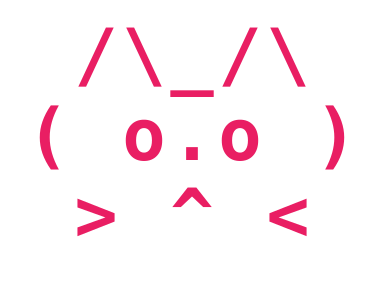

<div align="center">

# MikMik



MikMik is a high-performance Rust reimplementation of Claude Code — a terminal-native AI coding agent with streaming responses, 40+ built-in tools, 15+ LLM provider integrations, a full ratatui TUI, and an extensible plugin system.

**Version:** 0.0.0 (Beta) · **License:** GPL-3.0 · [GitHub](https://github.com/KilimcininKorOglu/mikmik)

</div>

---

## What MikMik does

You give MikMik a task in natural language. It plans, reads and writes files, runs shell commands, searches the web, and iterates — all inside your terminal, with every step visible in real time.

```
$ mikmik "add input validation to the signup form"
```

MikMik reads your codebase, implements the change across multiple files, runs your tests, and reports back — without you leaving the terminal.

---

## Key capabilities

### Agentic loop
MikMik runs a multi-turn loop: it streams a response from the model, executes any tool calls (file read, bash, web search, …), feeds the results back, and continues until the task is done or the turn limit is reached.

### 40+ built-in tools
- **File operations** — read, write, edit, patch, batch-edit
- **Shell** — bash with persistent working directory and environment
- **Search** — glob file patterns, grep contents, web search, web fetch
- **Git** — commit, branch, worktree
- **Notebooks** — read and edit Jupyter notebooks
- **Desktop automation** — screenshot, click, type (optional feature)
- **Task management** — create, track, and complete tasks

### 50+ LLM providers
Anthropic Claude (default), OpenAI, Google Gemini, AWS Bedrock, Azure OpenAI, GitHub Copilot, Codex, Cohere and MiniMax have native wire-format implementations. Around forty more speak the OpenAI format: Groq, Mistral, DeepSeek, xAI, OpenRouter, Together AI, Perplexity, Cerebras, and the rest. Local runtimes are Ollama, LM Studio, llama.cpp and MLX LM.

### AMOLED terminal UI
A ratatui-based TUI with real-time streaming, syntax-highlighted code blocks, diff viewer, permission dialogs, slash command autocomplete, session browser, and a full keybinding system.

### Multi-account credentials
Store multiple named Anthropic (Claude.ai / Console) and Codex (ChatGPT) accounts in one install and switch between them instantly with `/switch` or `mikmik auth switch <id>`. Identity is detected from the OAuth JWT, so re-logging-in the same account is idempotent. See [Authentication](auth#multiple-accounts).

### @file injection
Type `@path/to/file` anywhere in a prompt to inject the file's contents inline. Typeahead autocomplete suggests paths as you type, with size/binary safety checks before submit. See [@file Injection](keybindings#file-injection-with-typeahead).

### Plugin system
Extend MikMik with TOML-manifest plugins that add custom slash commands, MCP servers, hooks, output styles, and tool overlays.

### Multi-agent orchestration
Run named agents (`build`, `plan`, `explore`), or let the model spawn parallel sub-agents with the `Agent` tool. Agents communicate through a shared task registry and message channels, and `isolation: "worktree"` keeps parallel writers apart.

### Goal system
Set a durable objective with `/goal` and MikMik works autonomously across turns until the goal is verified complete — using the `Goal` tool's `complete` op for audited completion rather than just stopping.

### Managed agents (preview)
Configure a manager-executor architecture with `/managed-agents` where a manager model delegates subtasks to parallel executor agents under one shared budget.

### Output styles
Pick the voice the model writes in with `/output-style` or from the settings screen: controlled technical writing (`asd-ste100`), or a persona at three intensities (`caveman`, `rocky`).

---

## Quick start

**1. Install**

```bash
# Linux / macOS
curl -fsSL https://github.com/KilimcininKorOglu/mikmik/releases/latest/download/install.sh | bash
```

```powershell
# Windows (PowerShell)
irm https://github.com/KilimcininKorOglu/mikmik/releases/latest/download/install.ps1 | iex
```

The installer auto-detects your platform and architecture, drops `mikmik` into
`~/.local/bin` (or `%LOCALAPPDATA%\Programs\mikmik` on Windows), and adds that
directory to your `PATH`. See [Installation](installation) for flags, manual
download, and uninstall steps.

**2. Set your API key**

```bash
export ANTHROPIC_API_KEY=sk-ant-...
```

**3. Run interactively**

```bash
mikmik
```

Or send a single prompt and exit:

```bash
mikmik --print "explain the auth module"
```

---

## Configuration

MikMik reads `~/.config/mikmik/settings.json` at startup. The most common settings:

```json
{
  "config": {
    "model": "claude-opus-4-6",
    "permission_mode": "default",
    "auto_compact": true,
    "compact_threshold": 90
  }
}
```

See [Configuration](configuration) for the full reference.

---

## Using a different provider

```bash
# Use Ollama with a local model
mikmik --provider ollama --model llama3.2

# Use OpenAI
OPENAI_API_KEY=sk-... mikmik --provider openai --model gpt-4o
```

See [Providers](providers) for setup instructions for every supported provider,
or the [Local Models](local-models) guide for running against llama.cpp,
LM Studio, Ollama, or any OpenAI-compatible server on your own machine.

---

## Interactive vs headless

| Mode            | Command                                      | Use case             |
|-----------------|----------------------------------------------|----------------------|
| Interactive TUI | `mikmik`                                    | Day-to-day coding    |
| Single prompt   | `mikmik "task"`                             | Quick one-shot tasks |
| Headless print  | `mikmik --print "task"`                     | Scripts, CI          |
| JSON output     | `mikmik --output-format json "task"`        | Machine consumption  |
| Stream JSON     | `mikmik --output-format stream-json "task"` | Real-time piping     |

---

## Slash commands

Inside the interactive TUI, type `/` to see all available commands. Common ones:

| Command             | Description                                                              |
|---------------------|--------------------------------------------------------------------------|
| `/help`             | Show all commands                                                        |
| `/model`            | Switch model or provider                                                 |
| `/login`            | OAuth login (Anthropic; `--codex` for ChatGPT, `--label <name>` to name) |
| `/accounts`         | List stored Anthropic + Codex accounts                                   |
| `/switch <id>`      | Switch active account (`--codex` for Codex)                              |
| `/logout`           | Clear credentials for the active account (`--all` to purge)              |
| `/goal <objective>` | Set an autonomous multi-turn goal                                        |
| `/managed-agents`   | Configure manager-executor agents                                        |
| `/compact`          | Compress conversation history                                            |
| `/cost`             | Token usage and cost for this session                                    |
| `/insights`         | Session statistics and tool usage report                                 |
| `/rewind`           | Go back to a previous message                                            |
| `/copy`             | Copy last response to clipboard                                          |
| `/export`           | Save session transcript                                                  |
| `/think-back`       | View thinking traces from previous responses                             |
| `/ultrareview`      | Exhaustive multi-dimensional code review                                 |
| `/advisor <model>`  | Set a secondary advisor model, or let one watch every turn               |
| `/sandbox-toggle`   | Toggle sandboxed shell execution                                         |
| `/update`           | Check for and download updates                                           |
| `/exit`             | Quit                                                                     |

See [Slash Commands](commands) for the complete reference.

---

## Next steps

- [Installation](installation) — download, build from source, system requirements
- [Authentication](auth) — API keys and OAuth
- [Configuration](configuration) — settings.json reference
- [Slash Commands](commands) — all 70+ commands
- [Tools Reference](tools) — all 40+ tools and permission levels
- [Providers](providers) — configuring each LLM provider
- [Local Models](local-models) — llama.cpp, LM Studio, Ollama, and other OpenAI-compatible servers
- [MCP Integration](mcp) — Model Context Protocol servers
- [Plugins](plugins) — building and using plugins
- [Agents](agents) — multi-agent orchestration
- [Hooks](hooks) — event-driven automation
- [Remote Control](remote-control) — drive a session from your phone through a self-hosted relay
- [Workspace Server](workspace-server) — a company's own server for accounts, providers, policy and backups
- [Advanced Features](advanced) — extended thinking, sessions, and more
